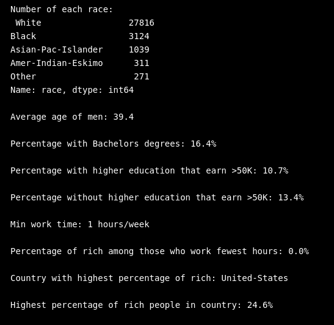
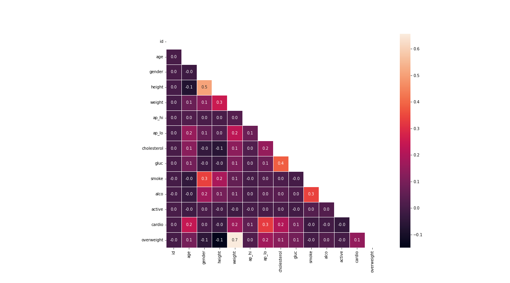
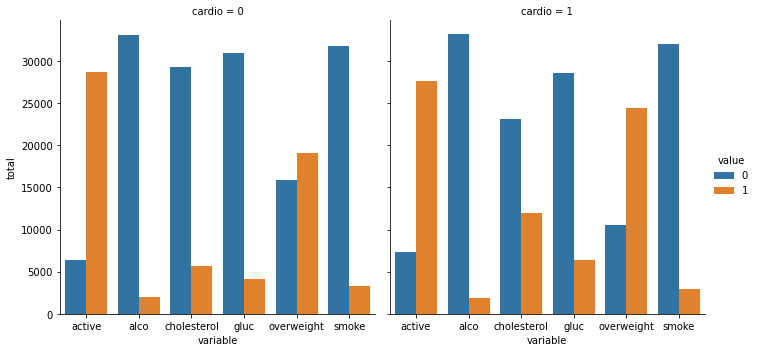
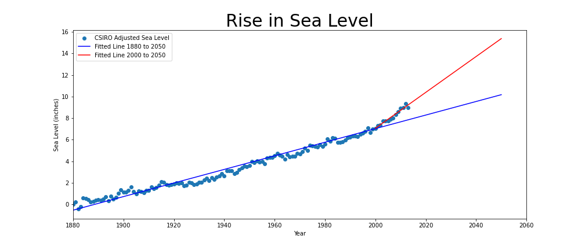
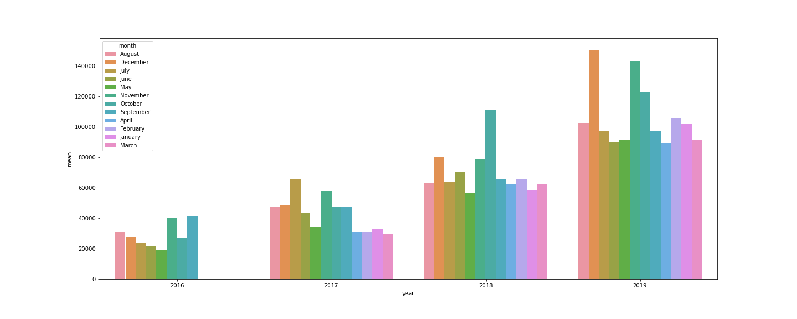
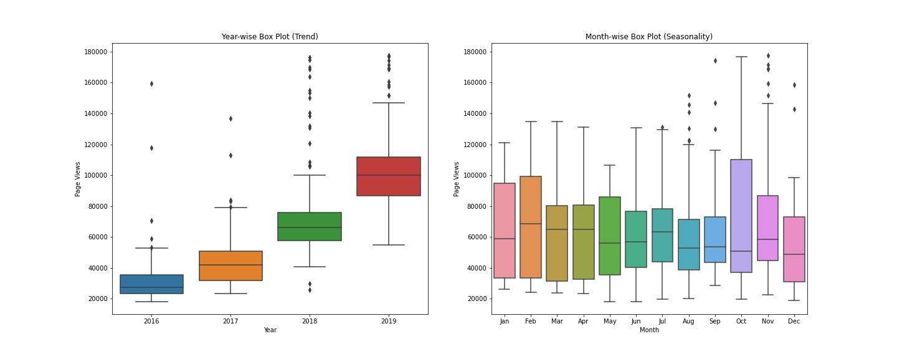
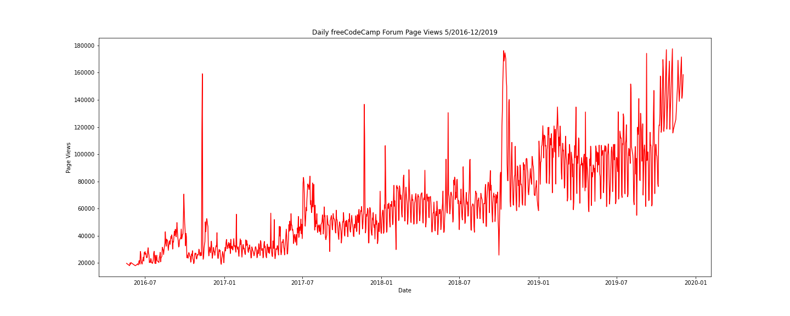

# FREE CODE BOOTCAMP
Data Analysis with Python Course
Includes 4 projects that are added to this repository:

1. Demographic Data Analyzer ('demographic_data_analyzer.py')
2. Medical Data Visualizer	('medical examination.ipynb')
3. Page View Time Series Visualizer	('time_series_visualizer.ipynb')
4. Sea Level Predictor ('seal level predictor.ipynb')

## Table of Contents
* [General Info](#general-information)
* [Technologies Used](#technologies-used)
* [Features](#features)
* [Screenshots](#screenshots)
* [Usage](#usage)
* [Project Status](#project-status)
* [Room for Improvement](#room-for-improvement)
* [Acknowledgements](#acknowledgements)
* [Contact](#contact)
<!-- * [License](#license) -->


## General Information
1. Demographic Data Analyzer: quick project to demostrate my ability to manipulate data and dataframes to obtain required information for further analysis.	

2. Medical Data Visualizer: provide heatmap for correlation visualisation; catplot after group and melting data points

3. Page View Time Series Visualizer: imports and clean data, creates boxplots, line plots, bra plots with time series as x values (years or months)

4. Sea Level Predictor: creates two fitted lines based on various points for future prediction	


## Technologies Used
Libraries udes for the projects:
**Numpy, Pandas, Matplotlib, scipy.stats, Seaborn**


## Features
heatmap, catplot, diagrams, data preparation and manipulation, fitted lines


## Screenshots

 and 





## Usage
1. Demographic Analysis
```
    if print_data:
        print("Number of each race:\n", race_count)
        print("\nAverage age of men:", average_age_men)
        print(f"\nPercentage with Bachelors degrees: {percentage_bachelors}%")
        print(f"\nPercentage with higher education that earn >50K: {higher_education_rich}%")
        print(f"\nPercentage without higher education that earn >50K: {lower_education_rich}%")
        print(f"\nMin work time: {min_work_hours} hours/week")
        print(f"\nPercentage of rich among those who work fewest hours: {rich_percentage}%")
        print("\nCountry with highest percentage of rich:", highest_earning_country)
        print(f"\nHighest percentage of rich people in country: {highest_earning_country_percentage}%")
        print("\nTop occupations in India:", top_IN_occupation)
    
    return {
        'race_count': race_count,
        'average_age_men': average_age_men,
        'percentage_bachelors': percentage_bachelors,
        'higher_education_rich': higher_education_rich,
        'lower_education_rich': lower_education_rich,
        'min_work_hours': min_work_hours,
        'rich_percentage': rich_percentage,
        'highest_earning_country': highest_earning_country,
        'highest_earning_country_percentage': highest_earning_country_percentage,
        'top_IN_occupation': top_IN_occupation
    }
```

2. Medical examination
```
    f_heat = df[(df['ap_lo'] <= df['ap_hi'])&
             (df['height'] >= df['height'].quantile(0.025))&
            (df['height'] <= df['height'].quantile(0.975))&
            (df['weight'] >= df['weight'].quantile(0.025))&
            (df['weight'] <= df['weight'].quantile(0.975))]

    # Calculate the correlation matrix
    corr=df_heat.corr()

    # Generate a mask for the upper triangle
    mask = np.triu(np.ones_like(corr, dtype=bool))

    # Set up the matplotlib figure
    fig, ax = plt.subplots(figsize=(18, 10))

    # Draw the heatmap with 'sns.heatmap()'
    g=sns.heatmap(corr, mask=mask, square=True, annot=True, fmt=".1f", linewidths=.5, ax=ax)

    # Do not modify the next two lines
    fig.savefig('images/heatmap.png')
```
3. SeaLevel Predictor
```
    #PLOT
    fig = plt.figure(figsize=(14, 6))
    plt.scatter(x='Year', y='CSIRO Adjusted Sea Level', data=df)
    plt.plot(df1['Year'], fit , label='Fitted Line 1880 to 2050', color='b')
    plt.plot(fitline2['Year'], fit2 , label='Fitted Line 2000 to 2050', color='r')
    plt.xlim([1880, 2060])
    plt.title('Rise in Sea Level', fontdict = {'fontsize' : 30})
    plt.xlabel('Year')
    plt.ylabel('Sea Level (inches)')
    plt.legend()
        
    # Save plot and return data for testing (DO NOT MODIFY)
    plt.savefig('images/sea_level_plot.png')
    plt.show()
    return plt.gca()

```

## Project Status
All projects are: _no longer being worked on_

## Acknowledgements
Give credit here.
- These projects was inspired by Free Code Camp online program


## Contact
Created by [@irinakw](irina.k.white@gmail.com) - feel free to contact me!